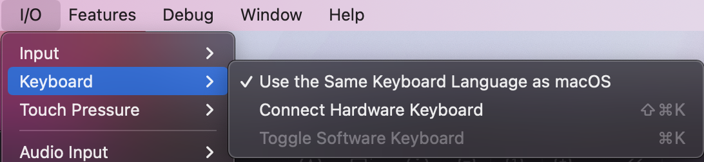

# Mobile iOS Applikationen 21HS 5iCa

## Projektarbeit 2

### Bearbeitet von

* Ramona Marti
* Remo von Arx

### Abgabe

* 20.01.2022 23:59

### Aufgaben-Checkliste
- 1
- 2
- 3
    * Custom-Background Image wenn kein Background-Image hinterlegt ist
    * 2 Opacities für Hintergrundfarbe und -bild seperat einstellbar
    * Image opacity in Art Wall Übersicht angewendet 
- 4
- 5
    * 2 weitere Tests für add Emoji und 2 Tests für remove Emoji 
- 6

(Eingerückte Punkte wurden zusätzlich implementiert.)

### Testing & Fastlane

Wenn die UI Tests nicht durchlaufen, liegt es daran, dass die Pop-Up Tastatur des Simulatorgerätes nicht auftaucht. Um dieses Problem zu beheben muss der verwendete Simulator (wahrscheinlich iPhone 8) gestartet werden und die Einstellung angepasst werden. Einstellungen wie folgt: Entferne den Check neben 'Connect Hardware Keyboard'

\
Sollte der Test immer noch fehlschlagen, liegt es daran, dass der doubleTab auf das Textfield nicht ausgeführt wurde. Es kann helfen den Test nochmals auszuführen.
